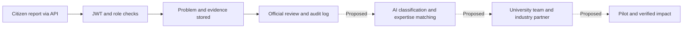

# PragatiX — SIH 26043 presentation evidence and references

Reviewed: 13 September 2026. Code baseline: `ea74202`, branch `parthbackend`.
Problem statement text and ID were confirmed by the team in this conversation.

**Problem:** A digital platform to crowdsource societal challenges and facilitate collaborative problem solving through universities and industry partnerships.
**Organization:** Government of Jharkhand. **Department:** Higher & Technical Education. **Theme:** Smart Education. **Category:** Software.

This is a content guide, not an official SIH slide template. Fit these blocks into the template supplied by your SPOC. Application code was not modified for this review.

## 1. What the code currently proves

| Capability | Current status | Evidence |
| --- | --- | --- |
| React website and responsive layout | Implemented | `frontend/src/App.jsx`, `App.css` |
| Register/login/logout and session restore | Frontend connected to auth APIs | `frontend/src/lib/authApi.js`, `components/AuthModal.jsx`, auth controller |
| JWT, password hashing, refresh sessions | Implemented in backend | `backend/src/controller/authController.js` |
| Seven roles, ownership and private problem access | Implemented; automated route tests pass | `backend/src/config/rbac.js`, auth/problem access middleware |
| Problem create/list/read/update/delete | Backend APIs implemented | `backend/src/routes/problemRoutes.js`, problem controller |
| Official verification and manual duplicate marking | Backend implemented | `verifyProblem`, `isDuplicateOf`, `duplicateNote` |
| Upvotes, comments, ratings/feedback | Backend implemented | Problem routes/controller |
| Local evidence uploads and protected downloads | Backend implemented | Upload middleware and `backend/index.js`; currently disk storage |
| Submit challenge through the website | UI prototype only | Form only calls `setSubmitted(true)`; no problem API call |
| Domain classification | Manual domain input; defaults to OTHER | Create validation/controller; no model inference |
| AI deduplication and automatic priority calculation | Not implemented | Duplicate/score fields exist, but no AI or scoring algorithm |
| University matching, teams and proposals | Prisma schema only | UniversityProfile, Assignment, Team, Proposal |
| Industry mentorship, partnerships and funding | Prisma schema only | IndustryProfile, Partnership, Funding |
| Project milestones, patents, startups and impact | Prisma schema only | Project, Milestone, ImpactRecord |
| Notifications and live analytics | Schema/UI placeholders | Notification model; static frontend analytics |
| Hindi interface | Label toggle only | Language button changes label; page is not translated |
| District/department access scope | Not implemented | Staff permissions are currently platform-wide |

Cloudinary packages are installed, but the actual upload middleware uses local disk. The active authentication path uses bcrypt/JWT/Prisma; the presence of older Supabase Auth configuration does not mean the active flow uses Supabase Auth.

Before an end-to-end multimedia demo, handle multipart form conversion: Multer supplies text fields as strings, while the current schema expects numbers for coordinates/peopleAffected and a boolean for isPublic. JSON requests and text-only upload submissions do not exercise this combined case. This review documents the gap without changing the application.

The database schema has 31 models, but a model count does not establish completed product functionality. Eight status values exist; that does not establish a fully enforced eight-stage project workflow.

### Claims to correct before presenting

The website currently displays `24 Districts connected`, `40+ Higher education institutions`, fixed theme percentages and a `Live insight` message. These are hard-coded display content, not measured adoption or analytics.

Use “Designed for Jharkhand's 24 districts” with an official source. Do not claim that 24 districts or 40+ institutions have joined. Describe theme percentages as demo data if shown. `peopleAffected: 250` is a submitted estimate; it is not 250 verified beneficiaries.

## 2. Problem clarity

Ready-to-use slide sentence:

> Citizens can identify local challenges, while universities and industry hold complementary expertise and resources. PragatiX proposes a shared process to connect verified needs with accountable teams and track outcomes.

Use the team's pipeline-leak example as an illustrative scenario, not field evidence:

1. A resident reports a pipeline leak near a school.
2. An authorized official reviews the location and evidence.
3. A suitable university team is proposed for investigation or an appropriate innovation project.
4. An industry partner supports a prototype or pilot where needed.
5. Community validation confirms whether the intervention worked.

Explain the triage decision: routine maintenance should go to the responsible service department; recurring or complex challenges may warrant university/industry innovation. Automatic triage/routing is proposed, not implemented. The problem statement identifies a coordination gap; avoid claiming that no grievance system exists anywhere.

Problem graphic: four stakeholder icons (citizen, government, university, industry), broken handoff arrows, and three callouts: fragmented reporting, unclear project ownership, missing outcome evidence.

## 3. Visual solution and architecture

Use green for implemented backend behavior, amber for schema-only modules, and dashed blue arrows for proposed automation. Keep these labels visible.

The current website submission form is a UI prototype. Show the API/Postman flow as the current working submission demonstration.

Technical architecture labels:

- React/Vite: landing page and connected authentication.
- Express: auth and problem APIs.
- Zod: request validation.
- bcrypt + JWT + database session records: authentication.
- RBAC + ownership rules: access to operations and private records.
- Prisma → PostgreSQL: persistent records and relationships.
- Multer → local disk: uploads, with authorized download route.
- Future service: classifier, semantic similarity, university matching and notifications.

Do not draw an active AI service, Cloudinary integration or complete university dashboard as currently deployed.

## 4. Technical proof for judges

Current verification: 9/9 backend RBAC test groups passed; frontend lint and production build passed. The backend tests use mocked Prisma records, actual JWT checks and local HTTP requests. They do not prove production load capacity, live database performance or measured field impact.

Suggested demo sequence using test accounts:

| Demo action | Expected evidence |
| --- | --- |
| Call a protected problem route without a token | HTTP 401 |
| Login and submit the pipeline example with an access token | HTTP 201 and generated problem ID |
| Attempt verification as a citizen | HTTP 403 |
| Verify with a trusted official account | HTTP 200 and verification fields |
| Try to read another user's private problem | HTTP 404 |
| Attempt private evidence download as an unauthorized user | HTTP 404 |
| Inspect problem/audit records after review | Stored reviewer/action details |

The automated suite already covers these authorization behaviors. Capture real Postman/database screenshots before using them as live integration proof. Keep passwords and full tokens out of screenshots. Public signup cannot create staff roles; demo staff accounts must be provisioned through trusted database administration.

Suggested proof strip:

> 7 roles defined · 14 auth/problem API endpoints · 12 domain values · 9/9 RBAC test groups passed

The 14 endpoints are 5 auth + 9 problem operations; health/home/download routes are excluded. The 12 domain values include OTHER. These are implementation counts, not adoption or AI-quality metrics.

## 5. Feasibility and numbers

Separate every number into one of three categories: verified implementation, external context, or proposed pilot target.

| Number | Type | Defensible wording |
| --- | --- | --- |
| 7 roles | Code evidence | Seven roles defined with backend permission checks |
| 14 endpoints | Code evidence | Five auth and nine problem API endpoints implemented |
| 12 domain values | Code evidence | Eleven named domains plus OTHER supported as manual inputs |
| 9/9 test groups | Test evidence | Current RBAC suite passed using mocked database records |
| 5 files, 20 MiB each | Configuration | Configured upload limits, not throughput measurements |
| 24 districts | External context | Jharkhand has 24 districts; prospective geographic scope |
| About 4,334 institutes / over 20,529 villages | External context | UBA figures reported by IIT Delhi as of July 2025; not PragatiX partners |
| 2 districts / 2 HEIs / 1 industry partner / 100 challenges / 4 weeks | Proposed pilot | Suggested pilot scope; partnerships and results are not established |

Jharkhand district source: [Government of Jharkhand district list](https://www.jharkhand.gov.in/Home/DistrictList).
UBA source and dated numbers: [IIT Delhi CRDT — Unnat Bharat Abhiyan](https://crdt.iitd.ac.in/project/unnat-bharat).

Feasibility argument: the auth and review backend can support a limited prototype demonstration today. A field pilot still needs frontend submission integration, verified institution profiles, university/industry workflows, deployment and monitoring. A reliable AI claim needs labelled data and evaluation.

Relevant risks and mitigations to show:

- Adoption: identify a named faculty coordinator, official reviewer and partner contact; their participation is an operational dependency.
- AI mistakes: suggest categories/matches and let a reviewer confirm them; this is a proposed design.
- Duplicate reports: combine text similarity with location and time, then review; similar words alone do not establish the same incident.
- Uploaded media: storage use grows with evidence volume. Local disk must be replaced or operated with durable backups for deployment.
- Access scope: current officials/admins have platform-wide permissions. District/department scoping needs implementation if the deployment requires it.

Illustrative storage planning only: 1,000 reports × 2 images × 2 MiB = 4,000 MiB, approximately 3.9 GiB of new media, before backups. Maximum permitted uploads could be 1,000 × 5 × 20 MiB = about 97.7 GiB. Estimate operating costs from the selected host's current tariffs; no production cost has been measured here.

## 6. Impact: show a measurement plan, not invented success

Suggested pilot measurements:

| Metric | Measurement method |
| --- | --- |
| Time to verification | `verifiedAt - createdAt` for reviewed problems; report sample size and median |
| Institution assignment acceptance | Accepted assignments / reviewed eligible assignments; requires new workflow |
| Validated completion rate | Community-validated completed projects / accepted projects; requires validation workflow |
| Citizen satisfaction | Rating distribution and average with number of respondents; avoid treating self-selected ratings as representative |
| Beneficiaries | Deduplicated, field-verified beneficiaries after intervention; not summed reporter estimates |
| AI classification | Macro-F1 on a held-out, manually labelled dataset |
| Duplicate detection | Precision/recall on labelled duplicate and nonduplicate pairs |
| University matching | Reviewer-approved relevant university in top 3 suggestions / evaluated challenges |

The schema contains `citizensBenefited`, `villagesCovered`, `costSaved` and `jobsCreated` in ImpactRecord. Their presence does not establish measured outcomes or a functioning impact dashboard.

Illustrative efficiency scenario, clearly labelled **projection, not measured**:

> If 1,000 monthly reports take 20 minutes each to triage manually, and a future assisted process achieves 8 minutes, the potential saving is 1,000 × (20 − 8) / 60 = 200 staff-hours per month, a 60% reduction in triage time.

Neither baseline nor assisted time was measured in this project. Replace both with a fair timed comparison on the same tasks before reporting achieved savings. Do not convert triage savings into a claim of faster physical repair without measuring repair outcomes.

Research plan before claiming AI quality: start with a small labelled set spanning the 12 domains; separate train/validation/test by incident so duplicate versions do not leak across splits. Compare a simple keyword/text-classification baseline with a proposed language model. Report class/language coverage and errors; do not copy a paper's benchmark accuracy into PragatiX results.

## 7. Research and References slide

Use six short cards in a 3 × 2 grid. Each card contains: source + year, what it supports, corresponding PragatiX decision, and status. Use the linked paper title instead of a generic IEEE/Google/YouTube link. These are references selected during this review, not evidence that the implementation was originally derived from them.

### Card 1 — Policy alignment

**NEP 2020 — MyGov actionable points**
Supports community-engaged learning and industry-academia links. Map to the proposed university project and partnership workflow. The policy supports the direction; it is not approval or adoption of PragatiX.
[Official source](https://innovateindia.mygov.in/nep2020-citizen/themes/)

### Card 2 — Operational precedent

**Unnat Bharat Abhiyan — IIT Delhi**
Provides an existing example of higher education institutions engaging with rural challenges. Map to proposed faculty coordination and field validation. This does not establish an integration or partnership with UBA.
[Official programme reference](https://crdt.iitd.ac.in/project/unnat-bharat)

### Card 3 — Citizen participation research

**Daren C. Brabham (2009), Crowdsourcing the Public Participation Process for Planning Projects. Planning Theory, 8(3), 242–262.**
Supports the rationale for web-based public participation. Map to implemented problem intake, comments and upvotes; it does not prove local adoption or resolution effectiveness.
[Publisher / DOI](https://doi.org/10.1177/1473095209104824)

### Card 4 — Implemented security design

**David F. Ferraiolo and D. Richard Kuhn (1992), Role-Based Access Controls. 15th National Computer Security Conference.**
Supports role-mediated access. Map to implemented role checks, with additional ownership and visibility rules. Citation does not imply NIST certification.
[NIST paper page](https://www.nist.gov/publications/role-based-access-controls)

### Card 5 — Proposed semantic matching

**Nils Reimers and Iryna Gurevych (2019), Sentence-BERT: Sentence Embeddings using Siamese BERT-Networks. EMNLP-IJCNLP, 3982–3992.**
Supports using sentence embeddings for semantic similarity. Proposed application: duplicate candidates and challenge-to-expertise matching, followed by human review. No SBERT model is currently integrated. Local language/data performance needs testing.
[Open-access paper](https://aclanthology.org/D19-1410/)

### Card 6 — Proposed language support

**Sumanth Doddapaneni et al. (2023), Towards Leaving No Indic Language Behind: Building Monolingual Corpora, Benchmark and Models for Indic Languages. ACL, 12402–12426.**
Provides Indic language model and evaluation research. Candidate basis for evaluating Hindi/Indic text classification. This is proposed; do not claim automatic support for all Jharkhand languages or a working multilingual interface.
[Open-access paper](https://aclanthology.org/2023.acl-long.693/)

Optional reading if industry collaboration is central to the discussion: Etzkowitz and Leydesdorff (2000), *The dynamics of innovation: from National Systems and “Mode 2” to a Triple Helix of university–industry–government relations*. [Publisher / DOI](https://doi.org/10.1016/S0048-7333%2899%2900055-4). Use as a conceptual reference, not a claim of implemented partnerships.

## 8. Slide layout and speaking notes

Open `research-slide.html` for a standalone layout with clickable source links. It is a reference slide, not a screenshot of the product. Recreate its cards as editable PowerPoint shapes, or use the layout as a design guide within your required template.

Suggested arrangement across the presentation:

1. Problem: one pipeline-leak scenario and stakeholder handoff gaps.
2. Solution: workflow with implemented/planned labels.
3. Technical approach: architecture plus a real API/permission demonstration.
4. Feasibility: proposed pilot, operating dependencies and risks.
5. Impact: measurement formulas and labelled targets/projections.
6. Research: six source-to-design cards and a small code/test proof strip.

These are content blocks, not a claim about the current official slide count. Do not cram all six into the references slide. In that slide, prioritize four to six readable references and move full citations into notes if necessary.

Suggested 30-second explanation in Hinglish:

> Hamara proposal PS 26043 ke citizen–university–industry coordination gap ko address karta hai. NEP aur UBA is direction ka policy aur operational context dete hain. Prototype mein secure authentication, problem APIs, role checks aur audit logging implemented hain, aur 9 RBAC test groups pass hain. Sentence-BERT aur Indic language research future classification aur matching ke candidate approaches hain. Pilot ke through hum verification time, matching relevance aur community-validated outcomes measure karenge.

For a screenshot-based technical slide, use a genuine API request/response, one denied permission request and the test summary. Caption UI-only screens “UI prototype”; caption the future university/AI diagram “proposed workflow”.
